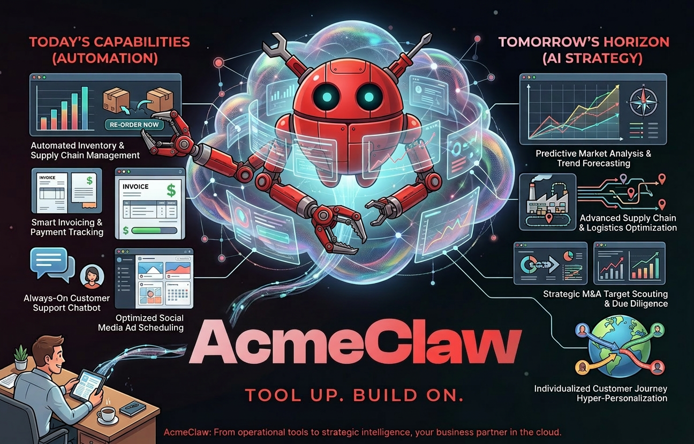

  

<h1 align="center">AcmeClaw</h1>
<h3 align="center">Tool Up. Build On.</h3>

  <a href="https://acmeclaw.ai">Website</a> &bull;
  <a href="https://www.linkedin.com/in/chad-david-hendren/">LinkedIn</a> &bull;
  <a href="https://huggingface.co/chendren">Hugging Face</a>

---

## What is AcmeClaw?

AcmeClaw delivers managed OpenClaw instances, AI agent development, professional services, and custom applications — built with the Working Backwards methodology from the book **Ship the Press Release**.

### Services

| Service | Description |
|---------|-------------|
| **Managed OpenClaw** | Fully managed, sandboxed OpenClaw deployments with vetted skill registry and enterprise ops |
| **AI Agent Development** | Custom autonomous agents built with specification coding and test-first architecture |
| **Professional Services** | Strategic consulting for AI adoption, CX, and contact center transformation |
| **Project Management** | End-to-end leadership from PR/FAQ through deployment |
| **AI Adoption Simulations** | Business simulation exercises for adoption decisions before committing resources |
| **Custom App Development** | Full-stack builds using the Working Backwards methodology |

### The Book

**Ship the Press Release** — *How the AcmeClaw PR/FAQ Was Written, Every Test Defined, and Zero Code Existed — Then the Agent Built It*

A practitioner's guide to Working Backwards, Specification Coding, and the art of not fighting your AI. The companion repository is at [acmeclaw.ai/workingbackwards/repo/](https://acmeclaw.ai/workingbackwards/repo/).

### About

Built by **Chad Hendren** — Inventor, Author, 30+ years in CX & Telco, 33 patents.

---

<em>Ship the Press Release. Then build everything else.</em>

